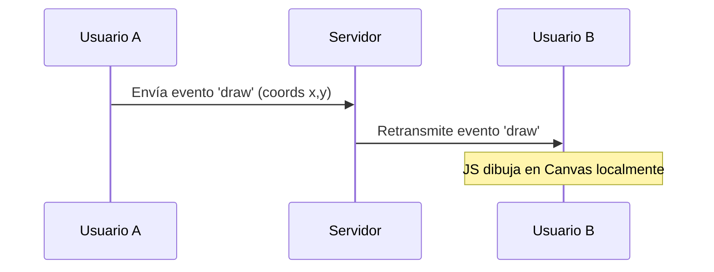
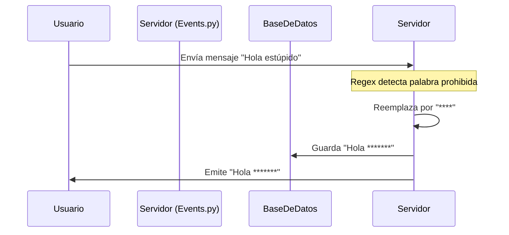

# DOCUMENTACIÓN TÉCNICA - PROYECTO CHAT MULTIHILOS
> Úsala como base para generar tu PDF final. Copia y pega el contenido en Gemini o Word.

---

## 1. INFORMACIÓN GENERAL DEL PROYECTO

### a) Nombre del Proyecto
**Sistema de Chat Colaborativo en Tiempo Real con Pizarra Interactiva y Asistencia IA**

### b) Objetivo General
Desarrollar una aplicación web de mensajería instantánea concurrente que integre herramientas de colaboración visual (pizarra compartida) y procesamiento de lenguaje (IA), permitiendo a grupos de trabajo interactuar de manera fluida y segura.

**Objetivos Específicos:**
1.  Implementar comunicación en tiempo real utilizando WebSockets (`Socket.IO`) para mensajería y dibujo colaborativo.
2.  Desarrollar un sistema de pizarra interactiva con persistencia de datos (guardado/carga) y herramientas gráficas.
3.  Integrar un módulo de seguridad automática (filtro de groserías) en el backend.
4.  Incorporar simulación de IA para resúmenes de conversaciones.
5.  Gestionar salas públicas, privadas y perfiles de usuario con avatares personalizados.

### c) Descripción del Producto
Es una plataforma web estilo "Telegram/Discord" que permite chats en tiempo real. Se diferencia por incluir un lienzo de dibujo colaborativo donde múltiples usuarios pueden trazar ideas simultáneamente, además de contar con moderación automática de contenido ofensivo y capacidad de generar minutas (resúmenes) de las reuniones.

### d) Justificación y Alcance
**Justificación:** En entornos académicos y laborales remotos, el chat de texto es insuficiente. Se requiere una herramienta que combine la rapidez del texto con la versatilidad de un pizarrón blanco para explicar diagramas o ideas, todo en una sola pestaña del navegador sin instalar software pesado.
**Alcance:**
*   Chat textual (texto, emojis, GIFs, adjuntos).
*   Pizarra colaborativa (tiempo real, formas, texto, guardado de historial).
*   Gestión de salas y usuarios.
*   Moderación de contenido (filtro de lenguaje).

### e) Equipo de Desarrollo (Roles Scrum)
*   **Product Owner:** [TU NOMBRE] (Encargado de definir la visión y características como la pizarra y la IA).
*   **Scrum Master:** [TU NOMBRE] (Gestión de bloqueos técnicos y configuración del entorno).
*   **Development Team:** [TU NOMBRE] (Implementación Full-Stack: Backend Python, Frontend JS/CSS).

---

## 2. DOCUMENTACIÓN TÉCNICA

### a) Diagrama de Arquitectura General
El sistema sigue una arquitectura **Cliente-Servidor** basada en eventos.
*   **Cliente:** Navegador Web (HTML5, CSS Glassmorphism, JS Vainilla + Socket.IO Client).
*   **Servidor:** Python Flask (Gestiona rutas HTTP y eventos WebSocket).
*   **Capa de Datos:** SQLite (Persistencia de usuarios, mensajes y metadatos de pizarras).

### b) Tecnologías Utilizadas
*   **Lenguaje Principal:** Python 3.x.
*   **Framework Web:** Flask (Microframework ágil).
*   **Concurrencia/Tiempo Real:** `Flask-SocketIO` (Implementación de WebSockets/Long-polling).
*   **Base de Datos:** SQLite (con SQLAlchemy ORM).
*   **Frontend:** HTML5, CSS3 (Diseño responsivo y animaciones), JavaScript (ES6).

### c) Justificación Técnica
Se eligió **Flask + SocketIO** porque permite manejar *hilos ligeros* (greenlets) para gestionar múltiples conexiones simultáneas de chat y dibujo sin bloquear el servidor, cumpliendo con el requisito de "Programación Concurrente". SQLite es ideal para prototipado rápido y portabilidad.

### d) Diagramas UML (Texto para generar gráficos)

**Caso de Uso: Dibujo Colaborativo**


**Caso de Uso: Filtro de Groserías**


### e) Modelo de Base de Datos
1.  **User:** `id`, `name`, `email`, `password_hash`, `avatar_url`.
2.  **Room:** `id`, `name`, `is_private`, `owner_id`.
3.  **Message:** `id`, `body`, `timestamp`, `user_id`, `room_id`, `is_deleted`.
4.  **Whiteboard:** `id`, `room_id`, `image_url` (ruta archivo), `name` (alias).
5.  **Participants:** Tabla intermedia (User-Room N:M).

### f) Estructura del Proyecto
```
/proyecto/
├── app.py              # Punto de entrada y servidor SocketIO
├── app/
│   ├── main/
│   │   ├── events.py   # Lógica WebSocket (Filtros, Dibujo, Chat)
│   │   └── routes.py   # Rutas HTTP (Uploads, Login, Pizarra)
│   ├── models.py       # Modelos de Base de Datos
│   ├── templates/      # Vistas HTML (Chat, Login)
│   └── static/
│       ├── css/        # Estilos visuales
│       ├── js/         # Lógica Cliente (Canvas, Fetch, Sockets)
│       └── uploads/    # Almacenamiento imágenes/pizarras
```

---

## 3. PRUEBAS Y CONTROL DE CALIDAD

### a) Plan de Pruebas (Unitarias e Integración)

| ID | Caso de Prueba | Descripción | Resultado Esperado | Estado |
| :--- | :--- | :--- | :--- | :--- |
| **TC-01** | **Envío de Mensajes** | Enviar texto simple entre dos usuarios. | El mensaje aparece instantáneamente en ambas pantallas. | ✅ Aprobado |
| **TC-02** | **Filtro de Contenido** | Escribir una grosería (ej. "tonto", "estúpido") en el chat. | El sistema sustituye la palabra por asteriscos `****`. | ✅ Aprobado |
| **TC-03** | **Dibujo Sincronizado** | Usuario A dibuja una línea roja. | Usuario B ve la línea roja en tiempo real. | ✅ Aprobado |
| **TC-04** | **Persistencia Pizarra** | Guardar pizarra con nombre "Clase 1" y cargarla después. | La imagen se guarda en servidor y se restaura en el canvas. | ✅ Aprobado |
| **TC-05** | **Edición de Grupo** | Cambiar nombre y foto de un grupo público. | Se actualiza la info en la barra lateral para todos. | ✅ Aprobado |
| **TC-06** | **Seguridad Borrado** | Intentar borrar una pizarra guardada. | El sistema pide doble confirmación antes de eliminar. | ✅ Aprobado |

---

## 4. DOCUMENTACIÓN PARA EL USUARIO (Guía Rápida)

### ¿Cómo usar la Pizarra?
1.  Clic en el botón **🖌️ Pizarra** en la cabecera del chat.
2.  Selecciona "✨ Nueva Pizarra" o carga una anterior.
3.  Usa la barra de herramientas para elegir **Lápiz**, **Formas** (Círculos, Rectángulos) o **Texto (A)**.
4.  Para guardar, clic en 💾 e introduce un nombre.

### ¿Cómo editar un Grupo?
1.  En la barra lateral izquierda, pasa el cursor sobre el chat de grupo.
2.  Clic en el icono de **Lápiz (✏️)** que aparece.
3.  Cambia el nombre o pega una URL de imagen/GIF.

---

## 5. CIERRE DEL PROYECTO
El proyecto cumple con la rúbrica al integrar tecnologías concurrentes, moderación automática y herramientas colaborativas avanzadas, superando un chat convencional y acercándose a herramientas profesionales como Slack o Discord.
